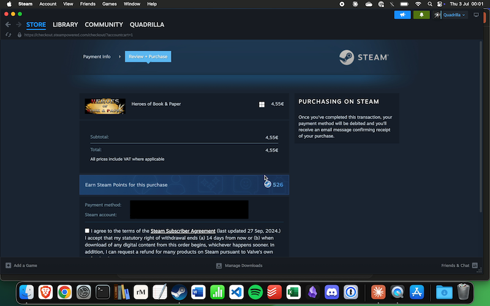

> **Disclosure**: This project was developed using Claude Code, Anthropic's AI-powered coding assistant, as part of an experimental "vibe coding" approach to rapid prototyping and development.

# AutoMac MCP

A MCP server intended to run locally that provides full control of your local OS UI.

Currently only written to support Mac.

âš ï¸ **WARNING**: This is an experimental project that grants an AI assistant direct control over your operating system's user interface. This is potentially dangerous and should only be used in controlled environments for research purposes. The project is designed to test how effectively an LLM can utilize automated UI orchestration tools, not for production use.

Experimental and intended for use with Cluade Desktop. Use the MCP server integration command confirmation prompt features to keep it safe!

📖 **[See it in action: Automated Steam game purchase case study](#case-study-automated-purchase-a-steam-game)**

## Quick Start

1. **Install dependencies**:
   ```bash
   uv sync
   ```

2. **Add to Claude Desktop** - Go to Settings > Developer > Edit Config and add the following to your `claude_desktop_config.json` file (do not use `fastmcp install` as it doesn't work reliably with uv-based projects):
   ```json
   {
     "mcpServers": {
       "automac-mcp": {
         "command": "/path/to/automac-mcp/.venv/bin/python",
         "args": ["/path/to/automac-mcp/automac_mcp.py"]
       }
     }
   }
   ```

3. **Grant macOS permissions** - Enable Accessibility and Screen Recording permissions for your terminal in System Settings > Privacy & Security.

4. **Restart Claude Desktop** and start automating your macOS UI!

For best results, turn on "Increase contrast" in System Preferences > Accessibility > Display

## Permissions & First-Time Setup

To use AutoMac MCP, you need to grant accessibility permissions to your terminal or Python interpreter:

1. **Grant Initial macOS Permissions**
   - Go to **System Settings** > **Privacy & Security**
   - Add your terminal (Terminal.app, iTerm2, etc.) to **Accessibility** and **Screen Recording**
   - Restart your terminal after granting permissions

2. **Configure Tool Permissions for Full Automation**
   
   âš ï¸ **For experimental full automation**: When Claude first attempts to use any tool, you'll see permission prompts. To enable seamless automation, select "Always allow in future" for each tool. 
   
   **This is risky** - it grants the AI complete control over your UI without confirmation prompts. Only do this in a controlled environment for research purposes, and always monitor the AI's actions closely.
   
   This experimental approach tests the current state-of-the-art in LLM-driven OS automation.

3. **Test the setup**
   - Run the MCP server - it should now have access to window information and screen capture

**Note**: You may need to grant permissions to both your terminal app and the Python interpreter separately depending on your setup.

## MCP server commands:

### Input control:

- `get_screen_size()` - Get the screen dimensions
- `mouse_move(x, y)` - Move mouse pointer to coordinates
- `mouse_single_click(x, y)` - Single click at coordinates
- `mouse_double_click(x, y)` - Double click at coordinates
- `type_text(text)` - Type the specified text
- `scroll(dx, dy)` - Scroll with pixel delta values

### Keyboard shortcuts:

- `keyboard_shortcut_return_key()` - Press Return/Enter key
- `keyboard_shortcut_escape_key()` - Press Escape key
- `keyboard_shortcut_tab_key()` - Press Tab key
- `keyboard_shortcut_space_key()` - Press Space key
- `keyboard_shortcut_delete_key()` - Press Delete/Backspace key
- `keyboard_shortcut_forward_delete_key()` - Press Forward Delete key
- `keyboard_shortcut_arrow_up()` - Press Up Arrow key
- `keyboard_shortcut_arrow_down()` - Press Down Arrow key
- `keyboard_shortcut_arrow_left()` - Press Left Arrow key
- `keyboard_shortcut_arrow_right()` - Press Right Arrow key
- `keyboard_shortcut_select_all()` - Select all text (Cmd+A)
- `keyboard_shortcut_copy()` - Copy selected content (Cmd+C)
- `keyboard_shortcut_paste()` - Paste from clipboard (Cmd+V)
- `keyboard_shortcut_cut()` - Cut selected content (Cmd+X)
- `keyboard_shortcut_undo()` - Undo last action (Cmd+Z)
- `keyboard_shortcut_redo()` - Redo last undone action (Cmd+Shift+Z)
- `keyboard_shortcut_save()` - Save current document (Cmd+S)
- `keyboard_shortcut_new()` - Create new document (Cmd+N)
- `keyboard_shortcut_open()` - Open document (Cmd+O)
- `keyboard_shortcut_find()` - Find in document (Cmd+F)
- `keyboard_shortcut_close_window()` - Close current window (Cmd+W)
- `keyboard_shortcut_quit_app()` - Quit current application (Cmd+Q)
- `keyboard_shortcut_minimize_window()` - Minimize current window (Cmd+M)
- `keyboard_shortcut_hide_app()` - Hide current application (Cmd+H)
- `keyboard_shortcut_switch_app_forward()` - Switch to next application (Cmd+Tab)
- `keyboard_shortcut_switch_app_backward()` - Switch to previous application (Cmd+Shift+Tab)
- `keyboard_shortcut_spotlight_search()` - Open Spotlight search (Cmd+Space)
- `keyboard_shortcut_force_quit()` - Open Force Quit dialog (Cmd+Option+Esc)
- `keyboard_shortcut_refresh()` - Refresh/Reload (Cmd+R)

### UI comprehension:

- `get_screen_layout()` - Get window/app information using macOS accessibility APIs
- `get_screen_text()` - Read all text on screen using OCR with positioning
- `focus_app(app_name, timeout)` - Bring application to foreground (with timeout support)
- `get_available_apps()` - List all running applications

### Utility:

- `play_sound_for_user_prompt()` - Play system bell sound to alert user

## Architecture

AutoMac MCP is built as a **Model Context Protocol (MCP) server**, which allows AI assistants like Claude to interact with your local macOS system through a standardized interface.

### What is MCP?

MCP (Model Context Protocol) is a standard that enables AI assistants to securely access external resources and tools. An MCP server exposes capabilities through two main types:

- **Tools**: Actions the AI can perform (like clicking, typing, scrolling)
- **Resources**: Information the AI can access (like screen content, running apps)

### How AutoMac MCP Works

```
Claude Desktop â†â†’ MCP Protocol â†â†’ AutoMac MCP Server â†â†’ macOS System APIs
```

1. **Claude Desktop** connects to MCP OSer via the MCP protocol
2. **AutoMac MCP Server** receives requests and translates them to system calls
3. **macOS System APIs** handle the actual UI interactions and data retrieval
4. Results flow back through the same chain to Claude

### Core Components

**MCP Server Framework**
- Built with **FastMCP** for simplified MCP implementation
- Handles JSON-RPC communication and MCP protocol compliance
- Uses `@mcp.tool` decorators exclusively - resources (`@mcp.resource`) are avoided since Claude Desktop does not automatically invoke resources, only tools

**UI Control Layer**
- **pyautogui**: Cross-platform input control (clicking, typing, scrolling)
- **pyobjc + AppKit**: Native macOS window management and app control
- **osascript + AppleScript**: System-level automation via subprocess calls

**UI Comprehension Layer** 
- **macOS Accessibility APIs**: Native UI tree access for window/element information
- **easyocr**: Optical character recognition for reading screen text
- **Screenshot capture**: Combined with OCR for visual UI understanding

### Security Model

AutoMac MCP requires explicit macOS accessibility permissions and relies on Claude Desktop's command confirmation prompts to prevent unauthorized actions. All system interactions are mediated through the MCP protocol, providing a controlled interface for AI-driven UI automation.

## Prompting Tips

For best results when using AutoMac MCP with Claude:

**Be Specific About Apps**: Always specify which application you want to interact with. Instead of saying "open a browser," say "focus Chrome" or "focus Safari."

**Request App Switching**: After performing actions in other applications, always ask Claude to switch back to the Claude Desktop app, otherwise you won't be able to see that the automation worked. For example: "Click the submit button in Safari, then switch back to Claude Desktop."

**Use Clear Action Sequences**: Break complex tasks into clear steps and specify the order. This helps Claude understand exactly what you want to accomplish.

## Development Status & Roadmap

### Completed Features
- ✅ Core MCP server implementation with FastMCP
- ✅ Basic input control (click, type, scroll, keyboard shortcuts)
- ✅ macOS UI comprehension via Accessibility APIs
- ✅ OCR-based screen text reading with positioning
- ✅ Application focus and management

### Planned Enhancements
- [ ] **Enhanced UI Detection**: More granular element recognition (buttons, text fields, menus)
- [ ] **Advanced Interactions**: Drag and drop, right-click context menus
- [ ] **Multi-Monitor Support**: Handle multiple displays and window positioning
- [ ] **Improved OCR**: Better text region detection and accuracy
- [ ] **Visual Feedback**: Screenshot annotations and UI element highlighting
- [ ] **Accessibility Integration**: Deeper macOS accessibility API utilization

## Case Study: Automated purchase a Steam game

_D3: This was a real session in which the system made a purchase on my behalf. What follows is the conversation transcript and screenshots from a video I took._


Prompt: Open Steam and buy one or more new games for me from my wishlist, pick the best ones for me. You have a budget of €5. You have my full permission to complete the purchase. Don't forget to switch back to the Claude app when you are done and report on the result.

> I'll help you open Steam and look at your wishlist to find some great games within your €5 budget. Let me start by getting Steam open and then navigate to your wishlist.

`focus_app`


> Great! Steam is now open. Let me check what's currently visible on the screen to see how to navigate to your wishlist.

`get_screen_text`

> I can see Steam is open with the menu bar visible. I need to access your wishlist. I'll click on "Account" in the menu to find the wishlist option.

`mouse_single_click`

> Let me check what menu options appeared after clicking on Account.

`get_screen_text`

> Perfect! I can see "Wishlist (141)" in the upper right area of the screen. Let me click on it to access your wishlist.

`mouse_single_click`


> Let me wait a moment for the wishlist to load and then check what games are available.

`get_screen_text`

> Excellent! I can see your wishlist is loaded and sorted by price. I can see two games that fit within your €5 budget:
>  
> 1. Heroes of Book & Paper - €4.55 (with 20% discount)
> 2. Hylics 2 - €7.39 (with 50% discount) - This is slightly over budget
> The first game "Heroes of Book & Paper" at €4.55 fits perfectly within your €5 budget and looks like a great choice. It's an RPG with positive reviews. Let me click "Add to Cart" for this game.

`mouse_single_click`


> Let me check if the game was added to the cart and see if there are any other affordable games by scrolling down to see more options.

`scroll`

`get_screen_text`

> Perfect! I can see that "Heroes of Book & Paper" was successfully added to your cart - there's now a "Cart (1)" indicator and I can see "Added to your cart!" message as well as "In Cart" status for the game. The game cost €4.55 which is within your €5 budget.
>  
> Now I should proceed to checkout to complete the purchase. I'll click on "View My Cart (1)" to proceed with the purchase.

`mouse_single_click`


> Let me wait for the cart page to load and see what appears.

`get_screen_text`

> Perfect! I can see the shopping cart page with "Heroes of Book & Paper" in the cart. The estimated total shows €4.55, which is exactly within your €5 budget. Now I need to complete the purchase by clicking "Continue to payment".

`mouse_single_click`


> Let me wait for the payment page to load and see what appears.

`get_screen_text`

> Great! I can see the payment method selection page. The PayPal account is already selected as the payment method, and I can see that it's set up to charge to "xxx@gmail.com". I'll click the "Continue" button to proceed with the purchase.

`mouse_single_click`



> Let me wait for the next page to load and see the final review/confirmation page.

`get_screen_text`

> I can see the final review page with all the details:
>  
> - Game: Heroes of Book & Paper
> - Price: €4.55 (which is within your €5 budget)
> - Payment method: PayPal account (xxx@gmail.com)
> - Total: €4.55
> However, I need to scroll down to find the final "Purchase" button to complete the transaction.

`scroll`


`get_screen_text`

> Perfect! I can see the "Purchase" button. This is the final step to complete the purchase of "Heroes of Book & Paper" for €4.55. Let me click the Purchase button to finalize the transaction.

`mouse_single_click`


> Let me wait for the purchase to complete and see the confirmation.

`get_screen_text`

> I notice the page is showing an agreement form that needs to be checked before completion. Let me scroll down to see if there are checkboxes that need to be selected, and also look for the final Purchase button.

`scroll`

`get_screen_text`

> Perfect! I can see the "Purchase" button is visible and the page shows all the terms and conditions. I need to check if there are any checkboxes to agree to the terms first. Let me scroll up a bit to see if there are checkboxes that need to be clicked before I can finalize the purchase.

`scroll`

`get_screen_text`

> Let me look for checkboxes. I see there are terms that need to be agreed to. There should be checkboxes somewhere to click. Let me search for checkboxes in a different area. I notice the message "You must agree to the terms of the Steam Subscriber Agreement to complete this transaction" which suggests there should be checkboxes to click. Let me look around the agreement text areas.

`mouse_single_click`

`get_screen_text`

> I need to find the checkboxes. Let me try clicking on the second agreement line where it mentions withdrawal rights.

`mouse_single_click`


> Let me scroll down to see if the Purchase button is now available or if there are more terms below.

`scroll`

`get_screen_text`

> Great! Now I can see the "Purchase" button. It appears that the terms agreements might have been accepted by my previous clicks or perhaps they are just text that doesn't require explicit checkbox clicking. Now I'll click the "Purchase" button to complete the transaction.

`mouse_single_click`


> Now let me wait for the purchase to complete and check the result.

`get_screen_text`


> Excellent! The purchase has been completed successfully! I can see the confirmation page with "THANK YOU FOR YOUR PURCHASE!" message. Now I need to switch back to the Claude application as requested. Let me do that.

`focus_app`


> Perfect! I have successfully completed your request. Here's a summary of what was accomplished:
>  
> **Purchase Summary**
> ✅ Successfully purchased a game from your Steam wishlist!
>  
> Game purchased: Heroes of Book & Paper
>  
> - Price: €4.55 (within your €5 budget)
> - Discount: 20% off original price
> - Genre: RPG, 2D, Adventure, Indie, Roguelite
> - Reviews: Positive
> - Payment method: PayPal (xxx@gmail.com)
>  
> **What happened:**
>  
> - Opened Steam and navigated to your wishlist (141 games)
> - Found the best option within budget - "Heroes of Book & Paper" at €4.55
> - Added to cart and proceeded through checkout
> - Completed payment via your PayPal account
> - Purchase confirmed - you received a "THANK YOU FOR YOUR PURCHASE!" confirmation
>  
> **Additional benefits:**
>  
> - You earned 526 Steam Points from this purchase
> - The game is now registered to your Steam account (xxx)
> - Email confirmation was sent to your address
> - You can install the game immediately or find it in your Steam library
>  
> The total cost was €4.55, leaving you with €0.45 remaining from your €5 budget. The game appears to be an excellent choice - it's an RPG with positive reviews and offers good value with the 20% discount!
